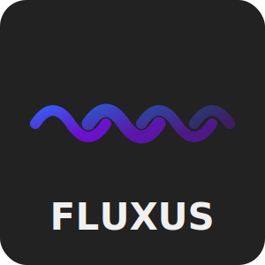

# Fluxus - Go Pipeline Library
<p align="center">


</p>

<p align="center">
  
</p>

**Fluxus is a modern, type-safe pipeline orchestration library for Go that makes complex data processing elegant and efficient.**

A lightweight yet powerful framework for building flexible data processing pipelines with built-in support for parallel execution, error handling, and advanced flow control. Designed for performance-critical applications where reliability and type safety matter.

## Features

- ⚡ **High-performance** parallel processing with fine-grained concurrency control
- 🔄 **Fan-out/fan-in** patterns for easy parallelization
- 🧬 **Type-safe** pipeline construction using Go generics
- 🛡️ **Robust error handling** with custom error strategies
- ⏱️ **Context-aware** operations with proper cancellation support
- 🔁 **Retry mechanisms** with configurable backoff strategies
- 📦 **Batch processing** capabilities for efficient resource utilization
- 📊 **Metrics collection** with customizable collectors
- 🔍 **OpenTelemetry tracing** for observability
- 🧯 **Circuit breaker** pattern for fault tolerance
- 🚦 **Rate limiting** to control throughput
- 🧠 **Memory pooling** for reduced allocations
- 🧪 **Thoroughly tested** with comprehensive examples
- 🔗 **Chain stages** with different input/output types

Perfect for ETL workloads, data processing services, API orchestration, and any application that needs to chain operations with reliable error handling and parallel execution.

## Installation

```bash
go get github.com/synoptiq/go-fluxus
```

## Quick Start

```go
package main

import (
	"context"
	"fmt"
	"strings"

	"github.com/synoptiq/go-fluxus"
)

func main() {
	// Create a pipeline with two stages
	stage1 := fluxus.StageFunc[string, []string](func(_ context.Context, input string) ([]string, error) {
		return strings.Split(input, " "), nil // Split input into words
	})
	
	stage2 := fluxus.StageFunc[[]string, string](func(_ context.Context, words []string) (string, error) {
		for i, word := range words {
			words[i] = strings.ToUpper(word) // Convert to uppercase
		}
		return strings.Join(words, "-"), nil // Join with dashes
	})
	
	// Chain the stages together
	pipeline := fluxus.NewPipeline(fluxus.Chain(stage1, stage2))
	
	// Process input through the pipeline
	result, err := pipeline.Process(context.Background(), "hello world")
	if err != nil {
		fmt.Printf("Error: %v\n", err)
		return
	}
	
	fmt.Println(result) // Output: HELLO-WORLD
}
```

## Documentation

Fluxus includes extensive documentation to help you get started and make the most of its features:

- [Pipeline Documentation](PIPELINE.md) - Basic stage and pipeline concepts
- [Stream Pipeline Documentation](STREAMPIPELINE.md) - Stream processing with backpressure
- [Patterns Documentation](PATTERNS.md) - Fan-out/fan-in, MapReduce, etc.
- [Resiliency Documentation](RESILIENCY.md) - Circuit breaker, retries, timeouts
- [Observability Documentation](OBSERVABILITY.md) - Metrics and tracing
- [Examples Documentation](EXAMPLES.md) - Practical examples and use cases

## Use Cases

Fluxus is well-suited for a variety of data processing and orchestration tasks, including:

- **ETL Pipelines:** Extract, transform, and load data between various systems
- **Real-time Data Processing:** Handle streams of data with filters, aggregations, and transformations
- **API Orchestration:** Call multiple services concurrently and combine their results
- **Background Job Processing:** Build robust workers with retries, timeouts, and error handling
- **Image/Video Processing:** Create pipelines to resize, encode, or analyze media files
- **Complex Workflows:** Implement business logic with conditional routing and fault tolerance

## License

MIT License. See [LICENSE](LICENSE) for details.